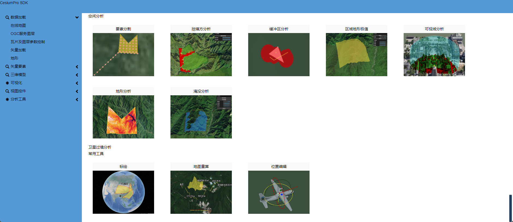

关于Cesium的二次封装，断断续续写了好几年了，最近两年由于岗位的变化对Cesium使用越来越少，已经无力维护了。
### 使用说明
1. 使用script引入
```html
    <script src="/cesium/Cesium/Cesium.js"></script>    
    <script src="/build/CesiumPro.js"></script>
    <link href="/thirdParty/cesium/Cesium/Widgets/widgets.css" rel="stylesheet"/>
    <link href="/build/assets/core.css" rel="stylesheet"/>
```
**建议使用这种方法引入**
**支持的Cesium最高版本为cesium 1.99**

2. 使用npm引入
```sh
npm install cesium@1.99 cesiumpro
```
```js
import * as Cesium from 'cesium';
import * as CesiumPro from 'cesiumpro';
...
```
如果使用npm引入，需要配置webpack
```js
module.exports = {
    configureWebpack: {
        plugins: [
            new webpack.DefinePlugin({
                // Define relative base path in cesium for loading assets
                CESIUM_BASE_URL: JSON.stringify(''),
                CESIUMPRO_BASE_URL: JSON.stringify(''),
             }),
            new CopyWebpackPlugin({
                patterns: [
                    { from: 'node_modules/cesium/Build/Cesium/Workers', to: 'Workers' },
                    { from: 'node_modules/cesium/Build/Cesium/ThirdParty', to: 'ThirdParty' },
                    { from: 'node_modules/cesium/Build/Cesium/Assets', to: 'Assets' },
                    { from: 'node_modules/cesium/Build/Cesium/Widgets', to: 'Widgets' },
                ]
            })
        ]
    }
}
```
### 开发
安装依赖后执行`npm start`可以本地运行，查看示例和文档



